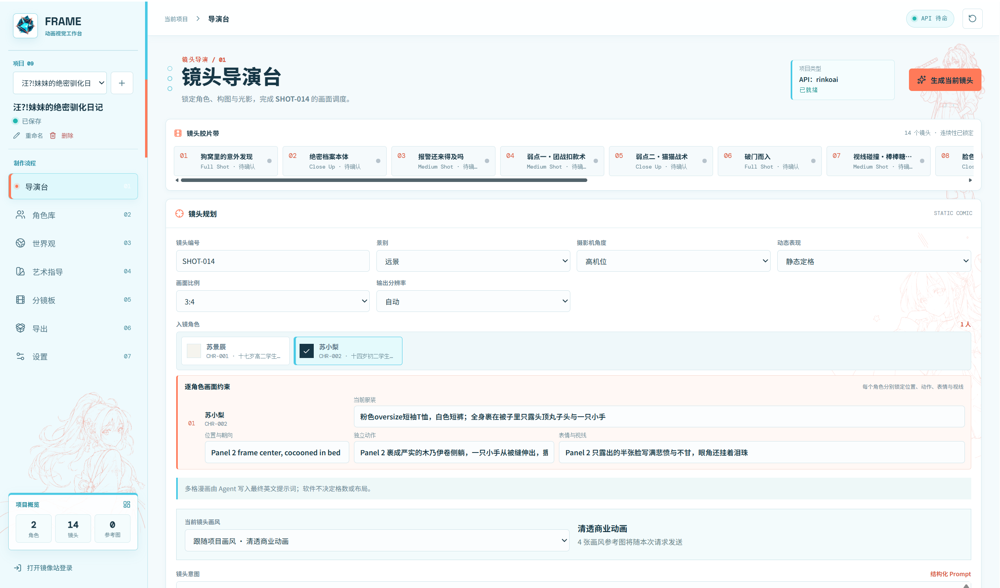
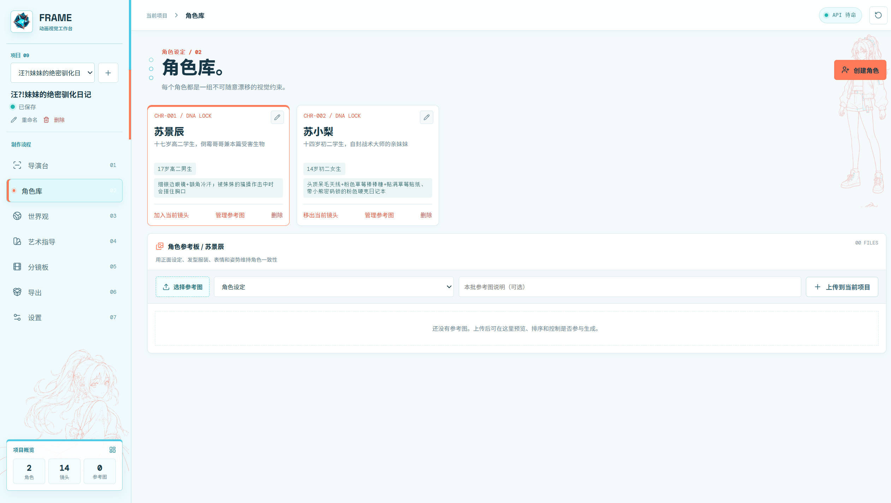
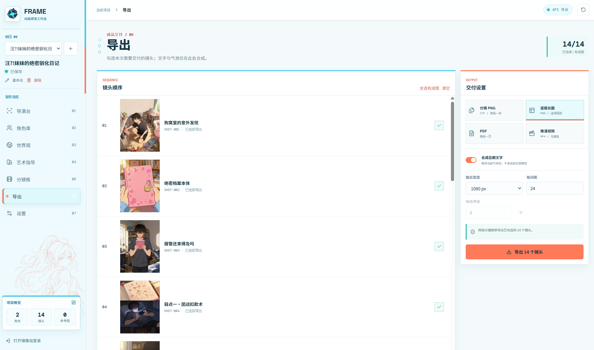

# FrameAnime Storyboard

## 软件介绍

`frame-anime-storyboard` 是本项目的核心 Codex skill。它可以读取短篇小说、同人文或指定段落，协助用户确认改编范围和镜头数量，再建立可审核的角色、世界观、艺术指导、镜头与后期文字。它支持 GPT 自然语言提示词和 NAI 英文标签两条路线，也支持续写已有项目和只修改指定镜头。

FrameAnimeDesk 是该 skill 的配套本地工具，用于查看和编辑分镜项目、管理角色与参考图、逐镜生成图片，以及导出 PNG、竖版长图、PDF 或无音轨 MP4。项目内容、登录状态、API Key、参考图和生成结果均保存在用户本机。

工作方式：

- skill 负责分析文本、规划改编并写入可审核的分镜项目；
- 用户在 FrameAnimeDesk 中检查和调整每个镜头；
- 用户确认后手动生成图片，全部完成后再导出作品；
- skill 不会自动点击生图或替用户自动导出。

## 安装

### 安装核心 skill

需要先安装 [Codex](https://openai.com/codex/)。在 PowerShell 中执行：

```powershell
git clone https://github.com/hy342736/FrameAnime-Storyboard.git
New-Item -ItemType Directory -Force "$env:USERPROFILE\.codex\skills" | Out-Null
Copy-Item -Recurse -Force ".\FrameAnime-Storyboard\skills\frame-anime-storyboard" "$env:USERPROFILE\.codex\skills\frame-anime-storyboard"
```

重新打开 Codex 后，可使用 `$frame-anime-storyboard`，并提供短篇文本或指定要改编的段落。

### 安装配套软件

从 [Releases](https://github.com/hy342736/FrameAnime-Storyboard/releases/latest) 下载 `FrameAnimeDesk.exe`，双击启动。Windows SmartScreen 可能显示“未知发布者”，这是因为当前开源版本尚未购买代码签名证书。

首次使用时先打开 FrameAnimeDesk。skill 会自动寻找本机正在运行的软件，不需要手动填写端口。使用镜像站通道时，需要在软件打开的浏览器窗口中登录自己的账号。

### 从源码运行软件

需要 Python 3.12 和 Node.js：

```powershell
cd FrameAnime-Storyboard
py -m venv .venv
.\.venv\Scripts\Activate.ps1
python -m pip install -r requirements.txt
python -m playwright install chromium
Copy-Item .env.example .env
python -m uvicorn app.main:app --host 127.0.0.1 --port 8000
```

然后打开 [http://127.0.0.1:8000/](http://127.0.0.1:8000/)。

## 示例

以下示例由 `frame-anime-storyboard` 将故事整理为 2 个角色、14 个镜头的项目，再通过 FrameAnimeDesk 审核、调整和生成。

### 镜头导演台



### 角色库



### 分镜板


### 导出


